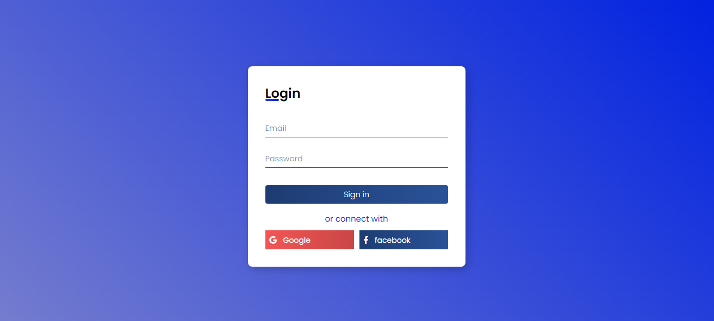

<h1 align="center">Formulário de login + validação</h1>

## Descrição

🚀 Este é um formulário de login simples e responsivo feito em HTML ,CSS.
E customização  o sistema de validação do html utilizando o javascript e css 

## Como Usar A validação
 1 . Definar type a os inputs e definar um atributo de validação html :
     Exemplo de atributo: required, pattern,etc.
     Exemplo: <input type="email" required> Recomendo sempre utilzar required nos campos que optar pela validação.

 2 .Importe o arquivo "script.js" no seu html.
    Exemplo: 

 3 .Instancie o objeto ValidateField enviado o 1 parâmetro(o elemento  para a validação);
    Exemplo 1: somente um
    const input = document.querySelector('input');
    new ValidateField(input);
    
    Exemplo 2 : mais de um
    const inputs = document.querySelectorAll('[required]'); 
    
    for (let input of inputs) {
        new ValidateField(input);
    }
    
## Modificar mensagens de erro ou adicionar na validação

 Pode modificar ou adicionar as mensagens de erro do jeito que desejar em customMessage . Se for     adicionar primeiro coloque o type do input e depois estado de validação.
   
    tel: type
    valueMissing e  patternMismatch:  estado de validação.

    Exemplo:
       customMessage(typeError) {
        const messages = {
            tel: {
                valueMissing:"Telefone é obrigátorio",
                patternMismatch: "Digite em formato telefone "
            },
        }

        return messages[this.input.type][typeError];
    }

## 🚀 Tela de Login

